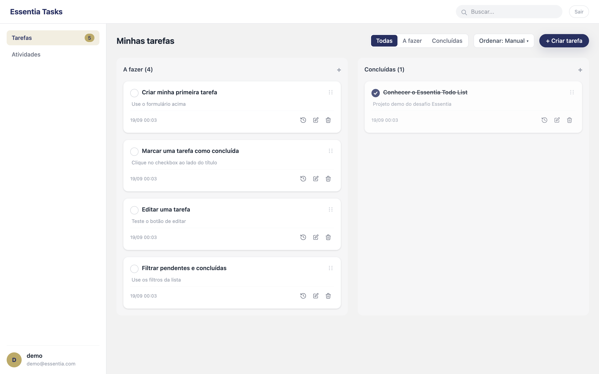
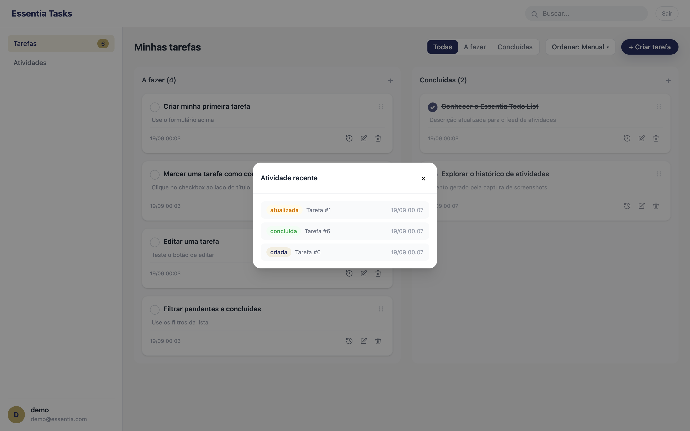

# Essentia Todo List
<!-- após o push, trocar SEU_USUARIO pelo usuário GitHub real -->
[](https://github.com/SEU_USUARIO/desafio-essentia-tecnologies/actions/workflows/ci.yml)

App web de gerenciamento de tarefas (to-do list) para os funcionários da Essentia organizarem o dia a dia.

> Desafio técnico Essentia Technologies (Menatech): CRUD de tarefas com **Angular** no front,
> API RESTful **Node.js + TypeScript (Fastify)** no back e **MySQL** como fonte da verdade —
> com extras opcionais (auth **JWT**, histórico em **MongoDB**).

## Stack e porquê

| Peça | Escolha | Porquê |
| --- | --- | --- |
| API | Fastify 5 | Schemas JSON de validação por rota, erro padronizado, Ajv estrito (`coerceTypes: false`, sem `removeAdditional` silencioso) |
| Schemas | TypeBox | Contratos TypeScript-first compartilhados entre validação Fastify e tipos do domínio |
| ORM | TypeORM | Entidades + migrations versionadas (`migrationsRun: true` — schema roda no boot, zero passo manual) |
| Fonte da verdade | MySQL 8 | CRUD relacional com escopo por usuário (`userId`) |
| Histórico | MongoDB 7 | Log de atividades append-only, isolado do relacional (degrada sem derrubar o CRUD) |
| Front | Angular 22 (signals) | Estado reativo com `signal`/`computed` nos stores (`task-store`, `auth-store`), sem NgRx para este escopo |
| Estilo | Tailwind v4 via PostCSS | `@tailwindcss/postcss` + `@import "tailwindcss"` em `styles.css` |
| Proxy prod | Caddy | Uma porta pública (:80): SPA estática + `reverse_proxy` de `/api/*` e `/health` para `backend:3000` |
| Lint/format | Biome | `biome.json` na raiz; roda local (`npx biome check .`), fora do CI |
| Testes | Vitest | Unit + e2e no back, unit/component no front (builder `@angular/build:unit-test`) |

## Arquitetura

```
browser → Caddy :80 ─┬─ /api/*, /health ─→ backend:3000 (Fastify)
                      └─ demais rotas ───→ SPA Angular (try_files → /index.html)
backend → MySQL (tasks, users) · MongoDB (activity_log, opcional)
```

- **Camadas (back):** `controller` (HTTP + TypeBox) → `service` (regras: escopo por dono, posição, eventos) → `repository` (TypeORM/Mongo) → `entity`.
- **DI por composition root** (`backend/src/container.ts`): factories `createTaskService` / `createAuthService` / `createActivityRepository` injetadas no `registerModules`; `overrides` existem para testes (ex.: service fake no e2e de edge).
- **Migrations** (`backend/src/database/mysql.data-source.ts`): `migrationsRun: true`, `synchronize: false`.
- **Front:** `pages` → `components` → `stores` (signals) → `api services` (`/api/*` relativo; dev usa `proxy.conf.json` → `http://localhost:3000`, prod resolve no próprio host via Caddy).

## Pré-requisitos

- **Docker** (engine + compose v2) — para bancos e para o quickstart completo.
- **Node 24.15** via nvm: `nvm use` (o `.nvmrc` trava `24.15.0`).
- **Portas livres:** `80` (frontend/Caddy), `3306` (MySQL), `27017` (Mongo).

## Quickstart (Docker — caminho principal)

```bash
export JWT_SECRET=$(openssl rand -base64 32)
docker compose up --build
```

- O compose exige `JWT_SECRET` **fail-fast** (`${JWT_SECRET:?...}` — sem a var, o `up` nem sobe).
- Dois `.env.example` de propósito: o da **raiz** documenta só o `JWT_SECRET` que o compose lê; o de `backend/` cobre o dev local/e2e (`DB_*`, Mongo, JWT).
- Aguarde os healthchecks (MySQL → Mongo → backend → frontend).
- Abra **http://localhost** (Caddy serve a SPA e proxya a API).
- Cheque a API pelo próprio host:

```bash
curl http://localhost/health
# {"status":"ok","db":"up"}
```

> Nota: o backend expõe `/health` (sem prefixo `/api`); o Caddy proxya tanto `/health` quanto `/api/*` para `backend:3000`.

## Seed demo

Com o compose no ar (ou com o backend local apontando para o MySQL), rode na raiz do repo:

```bash
npm run seed --prefix backend
```

- Idempotente: segunda execução não duplica (usuário por `findByEmail`, tarefas só se a tabela estiver vazia; órfãs pré-Fase-5 ganham `userId` do demo).
- Credenciais demo: **`demo@essentia.com` / `demo1234`** (+ 5 tarefas de exemplo vinculadas ao usuário).

## Desenvolvimento local (fallback sem compose full)

```bash
npm run setup                                  # install de backend/ + frontend/
docker compose up -d mysql mongo               # só os bancos (healthchecks inclusos)
cp backend/.env.example backend/.env           # ajuste se precisar (DB_* localhost, JWT local)
```

Em um terminal (API em `:3000`):

```bash
npm run dev --prefix backend
```

Em outro (SPA com proxy `/api` → `http://localhost:3000`):

```bash
npm start --prefix frontend
```

- Front dev: `ng serve --proxy-config proxy.conf.json` (ver `frontend/proxy.conf.json`).
- `npm run setup` é o **único** script da raiz — todo o resto vive em `backend/` ou `frontend/`.

## Testes

Números verificados em 2026-09-18 (todas as suítes **executadas**; e2e exige bancos no ar, roda no CI):

| Suíte | Cwd / comando | Resultado |
| --- | --- | --- |
| Back unit | `backend/` — `npm test` (`vitest run test/unit`) | **47** passed (task.service 36 + auth.service 11) |
| Back e2e | `backend/` — `npm run test:e2e` (`vitest run test/e2e`) | **35** its (auth 7 + health 2 + history 4 + tasks 22) — **exige MySQL + Mongo no ar** (`DB_TEST_*`, `MONGO_TEST_URL`; ver `backend/.env.example` e `ci.yml`) |
| Front | `frontend/` — `npm test -- --watch=false` | **45** passed, 7 arquivos |

```bash
npm test --prefix backend            # unit (sem bancos)
npm run test:e2e --prefix backend    # e2e (com MySQL + Mongo no ar)
npm test --prefix frontend -- --watch=false   # sem watch (CI usa igual)
```

## Endpoints

Base no compose: `http://localhost` (Caddy). Dev local: API em `http://localhost:3000`, front com proxy `/api`.

| Método | Rota | Auth | Descrição |
| --- | --- | --- | --- |
| `POST` | `/api/auth/register` | não | Cria usuário → `201 { id, name, email, createdAt }` |
| `POST` | `/api/auth/login` | não | Credenciais → `200 { token }` (JWT `sub` = userId) |
| `GET` | `/api/tasks` | sim | Lista do dono, ordem de `position` |
| `GET` | `/api/tasks/:id` | sim | Detalhe do dono (`404` cross-user) |
| `POST` | `/api/tasks` | sim | Cria (`position` = MAX+1 do dono, input ignorado) → `201` |
| `PATCH` | `/api/tasks/reorder` | sim | Reordena (`{ ids: [...] }`, `position` = índice 0-based) — declarar **antes** de `/:id` |
| `PATCH` | `/api/tasks/:id` | sim | Atualiza parcial (título/descrição/completed/`position`) |
| `DELETE` | `/api/tasks/:id` | sim | Remove → `204` |
| `GET` | `/api/tasks/:id/history` | sim | Histórico da tarefa (dono validado primeiro) |
| `GET` | `/api/activity` | sim | Feed global do usuário |
| `GET` | `/health` | não | Liveness + MySQL (`200 {status:"ok",db:"up"}` ou `503 DB_UNAVAILABLE`) |

```bash
BASE=http://localhost
curl -s -X POST $BASE/api/auth/register -H 'Content-Type: application/json' \
  -d '{"name":"Demo","email":"demo@essentia.com","password":"demo1234"}'
curl -s -X POST $BASE/api/auth/login -H 'Content-Type: application/json' \
  -d '{"email":"demo@essentia.com","password":"demo1234"}'
# {"token":"<JWT>"}
TOKEN=<cole o token>
curl -s $BASE/api/tasks -H "Authorization: Bearer $TOKEN"
curl -s -X POST $BASE/api/tasks -H "Authorization: Bearer $TOKEN" -H 'Content-Type: application/json' \
  -d '{"title":"Estudar README","description":"Ler com calma"}'
curl -s -X PATCH $BASE/api/tasks/1 -H "Authorization: Bearer $TOKEN" -H 'Content-Type: application/json' \
  -d '{"completed":true}'
curl -s $BASE/api/tasks/1/history -H "Authorization: Bearer $TOKEN"
curl -s $BASE/api/activity -H "Authorization: Bearer $TOKEN"
curl -s -X DELETE $BASE/api/tasks/1 -H "Authorization: Bearer $TOKEN" -i
curl -s $BASE/health
```

- **Erros:** envelope `{ code, message, details? }` — validação TypeBox/Ajv → `400 VALIDATION_ERROR`; sem token/inválido → `401 UNAUTHORIZED` (`Token ausente ou inválido`); tarefa de outro usuário/inexistente → `404 TASK_NOT_FOUND` (sem vazar existência alheia); email duplicado (incluindo condição de corrida via `ER_DUP_ENTRY`/1062) → `409 EMAIL_CONFLICT`; rota inexistente → `404 NOT_FOUND`; resto → `500 INTERNAL_ERROR`.
- **`position`:** inteiro ≥ 0; só-`position` no PATCH não gera evento de histórico (ver seção seguinte).

## Histórico / activity

- **5 ações** (`backend/src/modules/activity/activity-log.entity.ts`): `created`, `updated`, `completed`, `uncompleted`, `deleted`.
- **Escopo:** leitura sempre pelo `userId` do token — `GET /api/tasks/:id/history` valida o dono via `getById` escopado (cross-user → `404 TASK_NOT_FOUND`) e o feed `GET /api/activity` filtra por `userId`. DTO serializável (`ObjectId` → string, `changes` ausente → `null`).
- **Degradação sem Mongo (HIST-04):** se o Mongo cair no boot, o backend sobe com warn (`[main] mongo indisponível…`) e o CRUD MySQL segue; escrita de evento falha em silêncio e as rotas de leitura retornam `[]` com `200`.

## CI

- Workflow `check` (`.github/workflows/ci.yml`, job `verify`): sobe MySQL 8 + Mongo 7 como services, prepara `todo_test`, roda **unit → build back → testes front (`-- --watch=false`) → build front → e2e** com `DB_TEST_*`/`MONGO_TEST_URL` apontando para os services.
- **Lint (Biome) FORA do CI** por ora — o repo nunca foi lint-clean; rode local: `npx biome check .`.
- **Deploy fora de escopo** (placeholder comentado no fim do `ci.yml`).

## Limitações conhecidas

- Lint com diagnósticos pré-existentes (Biome aponta ~89 em arquivos de várias tasks) — mantido fora do CI até limpeza dedicada.
- Boot via compose leva ~30s+ por conta dos healthchecks encadeados (MySQL → Mongo → backend → frontend).
- Lista de tarefas sem paginação/busca server-side (filtro e ordenação são client-side nos signals).
- JWT com expiração de 12h (`JWT_EXPIRES_IN`), sem refresh token.
- Sem E2E de navegador (Cypress/Playwright) — cobertura é Vitest (unit/e2e de API no back, unit/component no front).

## Screenshots

| Lista de tarefas | Feed de atividades |
| --- | --- |
|  |  |

> Capturas reais do compose + seed demo (`demo@essentia.com`), logado na UI servida pelo Caddy.
